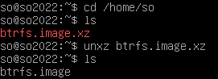
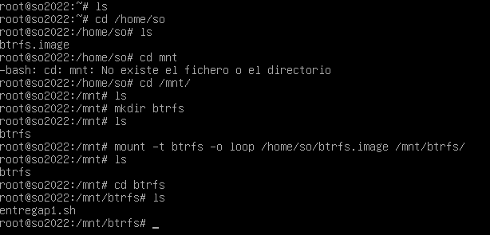
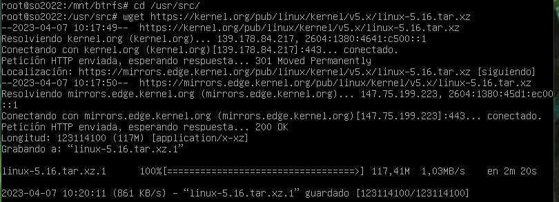
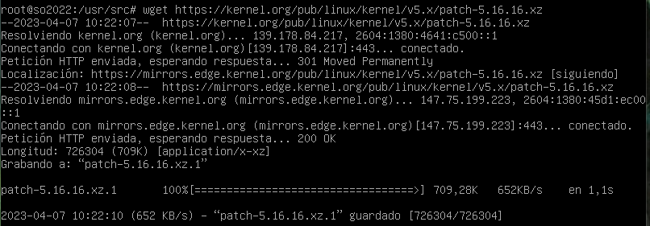
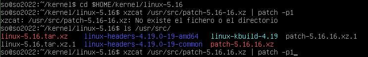
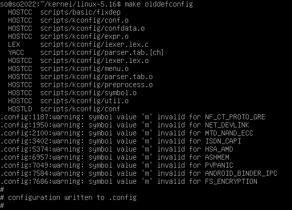
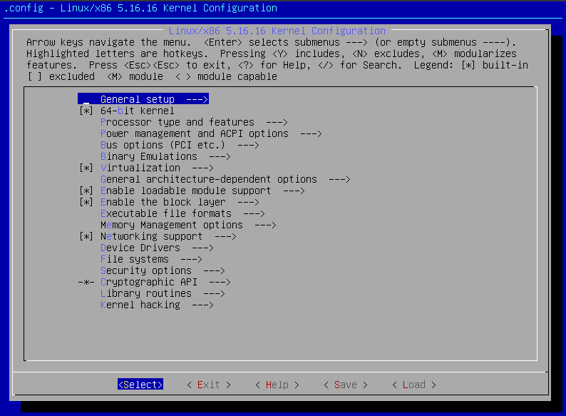
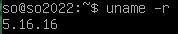

# Práctica 1

# Conceptos teóricos

1. El kernel de Linux es un programa que ejecuta programas y gestiona dispositivos de hardware. Permite la comunicación entre el software y el hardware. A groso modo el kernel es el sistema operativo. Sus principales funciones son la administración de memoria principal y CPU para controlar el acceso de los procesos, evitando así tiempo ocioso y sobrecarga.
2. Reseña en años:
   - 1991: Surge Linux 0.02. La primer versión oficial.
   - 1992: Surge 0.12. Se cambia la licencia a una GNU.
   - 1994: Surge 1.0. Todos los componentes están maduros.
   - 1995: Linux ya se porta en arquitecturas DEC Alpha y Sun SPARC.
   - 1996: Surge 2.0. Se define un sistema de nomenclatura.
   - 2001: Surge 2.4. Linux ya era robusto y estable.
   - 2003: Surge 2.6. Muchas mejoras del kernel dentro de las que se destacan los threads, mejoras de planificación y soporte del nuevo hardware.
   - 2004: Termina la versión 2 con 2.0.40.
   - 2010: Se deja de desarrollar 2.4 con 2.4.37.11.
   - 2011: Surge 3.0. No hay muchos cambios, se decidió cambiar por los 20 años del SO. Es compatible con 2.6.
   - 2015: Surge 4.0. Permite aplicar parches y actualizaciones sin reiniciar el SO. Soporta nuevas CPU.
   - 2019: Surge 5.0. Incorpora muchas cosas como por ejemplo nuevo mecanismo para manejar systemcalls de Windows y para crear áreas de memoria secretas.
   - 2021: 5.19. Soporte para paquetes IPv6.
   - 2022: 6.0. Soporta módulos escritos en Rust.
3. La arquitectura del kernel Linux se basa en un tipo de kernel monolítico, lo que significa que la mayoría de las funcionalidades del sistema operativo se implementan directamente en el núcleo y se ejecutan en modo kernel. Sin embargo, también se admiten módulos que se pueden cargar dinámicamente en el kernel en tiempo de ejecución para agregar funcionalidades adicionales al sistema.

   La portabilidad es una característica clave del kernel Linux y se ha implementado en una amplia variedad de arquitecturas de hardware, desde sistemas integrados hasta supercomputadoras. Esto se logra a través de una abstracción cuidadosa de la interfaz de hardware, lo que permite que el mismo código del kernel se ejecute en diferentes plataformas sin modificaciones importantes.

   El kernel Linux también cuenta con un sistema de gestión de procesos, gestión de memoria y gestión de entrada/salida muy avanzados que se han mejorado continuamente a lo largo de los años. En resumen, la arquitectura del kernel Linux se caracteriza por su flexibilidad, escalabilidad y capacidad de personalización.

4. Se cambio de la versión 2 a la 3 por los 20 años del SO y no superar los 40 números de revisión, fue un cambio estético. La versión 3.0 no incluyo cambios significativos o características nuevas en comparación con la 2.6; sin embargo introdujo mejoras de gestión de energía, mejoras de virtualización, mejoras de rendimiento de red y de soporte de hardware. El cambio de la versión 3 a la versión 4 del kernel de Linux se debió a las mejoras y actualizaciones significativas en el código del kernel, incluyendo mejoras en la gestión de la memoria, la seguridad, el soporte de hardware y la gestión de archivos.
5. Los versionados se definen de tres maneras:
   - Versión < 2.6: Venían 3 números separados por puntos: X.Y.Z. Dos versiones del kernel: números Y pares indicaban producción (estable) y los Y impares indicaban una versión en desarrollo.
     - X: serie principal. Funcionalidades importantes.
     - Y: indicaba si era de producción o desarrollo.
     - Z: bugfixes.
   - Versión ≥ 2.6 y < 3.0: Venían 4 números separados por puntos. A.B.C.[D]
     - A: Denota versión.
     - B: Cambios importantes.
     - C: Denota revisión menor. Solo con nuevos drivers o características.
     - D: Se soluciona un error sin agregar funcionalidad.
   - Versión ≥ 3.0: Se vuelve al esquema de 3 números.
     - A: Revisión mayor.
     - B: Revisión menor.
     - C: Numero de revisión.
     - rcX: Versiones de prueba.
6. Los usuarios recompilan sus kernels por distintas razones:
   - **Modificación de algún elemento del kernel**: Al recompilar su kernel, los usuarios pueden personalizar la configuración y las opciones del kernel para que se ajusten a sus necesidades específicas. Por ejemplo, pueden deshabilitar módulos que no necesitan, ajustar los parámetros de red para mejorar el rendimiento o agregar soporte para hardware específico.
   - **Corrección de errores**: La recompilación del kernel también puede mejorar el rendimiento del sistema en general. Al ajustar la configuración y las opciones del kernel, los usuarios pueden optimizar su sistema para un hardware específico o para un caso de uso específico. Esto puede llevar a mejoras en la velocidad de procesamiento, el uso de memoria y la eficiencia energética.
   - **Mejorar el rendimiento del kernel**: Si un usuario experimenta problemas o errores con su kernel actual, la recompilación del kernel puede ser una solución. Al modificar la configuración y las opciones del kernel, los usuarios pueden abordar problemas específicos y corregir errores que pueden estar causando problemas en su sistema.
   - **Actualizar de versión del kernel**: Los usuarios de GNU/Linux a menudo recompilan su kernel para actualizar a una nueva versión del kernel. Las nuevas versiones del kernel pueden incluir correcciones de seguridad, mejoras en el rendimiento y soporte para hardware nuevo. Al recompilar su kernel, los usuarios pueden asegurarse de que su sistema esté utilizando la versión más actualizada del kernel.
7. La opción de configuración a elegir dependerá de las necesidades y conocimientos técnicos del usuario. La configuración predeterminada es adecuada para la mayoría de los casos, mientras que la personalización completa del kernel puede ser necesaria para requisitos específicos. Los scripts de configuración automatizados son una opción intermedia que ahorra tiempo y reduce la posibilidad de errores.
8. Al realizar la configuración de un kernel hay muchas opciones a seleccionar. Entre ellas:
   - Opciones de hardware: Esta sección contiene opciones para habilitar el soporte de hardware en el kernel. Se pueden seleccionar controladores de dispositivo específicos, habilitar soporte para arquitecturas de procesador específicas, configurar opciones de memoria, etc.
   - Opciones de red: Esta sección contiene opciones para habilitar el soporte de redes en el kernel. Se pueden seleccionar opciones para protocolos de red específicos, configurar opciones de enrutamiento, etc.
   - Opciones de sistema de archivos: Esta sección contiene opciones para habilitar el soporte de sistemas de archivos en el kernel. Se pueden seleccionar sistemas de archivos específicos, habilitar opciones de cifrado, etc.
   - Opciones de seguridad: Esta sección contiene opciones para habilitar características de seguridad en el kernel. Se pueden seleccionar opciones para el control de acceso, habilitar características de SELinux, etc.
   - Opciones de depuración: Esta sección contiene opciones para habilitar la depuración del kernel. Se pueden habilitar opciones para el registro de errores del kernel, habilitar opciones de depuración para controladores de dispositivos específicos, etc.
9. Comandos de configuración/compilación del kernel:
   1. make menuconfig: permite genera el archivo `boot`. Este modo utiliza **ncurses**, una librería que permite generar una interfaz con paneles desde la terminal. Generalmente el más utilizado.
   2. make clean: se utiliza para eliminar todos los archivos que se crearon durante la compilación del kernel y que ya no son necesarios. Esto ayuda a limpiar el directorio de trabajo y a reducir la cantidad de espacio de almacenamiento utilizado.
   3. make (investigue la funcionalidad del parámetro -j): es utilizado en el proceso de compilación de programas y del kernel de Linux. La opción `-j`se utiliza para indicar al comando `make`que realice la compilación en paralelo, utilizando el número de hilos especificado como argumento después de la opción `-j`. Es importante tener en cuenta que el uso de la opción `-j` puede hacer que la salida del comando `make`sea más difícil de seguir, ya que las salidas de los distintos hilos de compilación se mezclan en la pantalla.
   4. make modules (utilizado en antiguos kernels, actualmente no es necesario): compila todos los módulos necesarios para satisfacer las opciones que hayan sido seleccionadas como módulo.
   5. make modules_install: es utilizado en el proceso de compilación del kernel de Linux para instalar los módulos del kernel compilados en el sistema.
   6. make install: es utilizado en el proceso de compilación del kernel de Linux para instalar el kernel compilado en el sistema.
10. Al terminar el proceso de compilación, la imagen se encuentra en `directorio/arch/arquitectura/boot/`. El próximo paso es instalar el kernel y otros archivos en `/boot`. El comando `sudo make install` lo hace automáticamente.
11. Un **initramfs** es un sistema de archivos temporal que se monta durante el arranque del sistema. Contiene ejecutables, drivers y módulos necesarios para lograr iniciar el sistema. Luego del proceso de arranque de disco se desmonta: `mkinitramfs -o /boot/initrd.img-5.16.16 5.16.16`.
12. Después de compilar e instalar un nuevo kernel en Linux, es necesario reconfigurar el gestor de arranque del sistema para que el nuevo kernel esté disponible y pueda ser seleccionado al inicio del sistema. La razón de esto es que el gestor de arranque es responsable de cargar el kernel en memoria y arrancar el sistema operativo. Cada vez que se instala un nuevo kernel en el sistema, se crea un nuevo archivo de imagen del kernel en el directorio **`/boot`**. Sin embargo, el gestor de arranque no tiene conocimiento automático de este nuevo kernel y no lo incluirá en la lista de opciones de arranque del sistema. Por lo tanto, es necesario reconfigurar el gestor de arranque para que se incluya el nuevo kernel. Esto se puede hacer mediante herramientas como GRUB o LILO, que son los gestores de arranque más comunes en sistemas Linux.
    En resumen, la razón por la que es necesario reconfigurar el gestor de arranque después de compilar e instalar un nuevo kernel es para asegurarse de que el sistema pueda arrancar correctamente utilizando el nuevo kernel.
13. Un módulo del kernel es un fragmento de código que puede cargarse o descargarse en el mapa de memoria del SO bajo demanda. Permiten extender la funcionalidad del Kernel sin necesidad de reiniciar el sistema. Todo el código se ejecuta en modo Kernel o sea privilegiado. Cualquier error en el módulo, puede colgar el S.O. Permite que el kernel se desarrolle bajo un diseño más modular. Los módulos disponibles se ubican en `/lib/modules/version` del kernel. Con el comando `lsmod` es posible ver qué módulos están cargados.
14. Patch es un mecanismo que permite aplicar actualizaciones sobre una versión base. Se basa en archivos **diff**, archivos de diferencia, que indican qué agregar y qué quitar. Los parches permiten agregar funcionalidad y a veces puede resultar más sencillo descargar el archivo diff y aplicarlo en vez de descargar todo el código de la nueva versión.

# Ejercicio taller: Compilación del kernel Linux

1. Una vez instalada la VM inicie sesión y descomprimí el archivo `btrfs.image.xz`.

   

2. No me dejaba crear el directorio “**btrfs**” dentro de **mnt** así que tuve que iniciar sesión como root. Según el inciso d) tuvo que haber fallado sin embargo me montó igual el dispositivo.

   

3. .

   1. `wget [https://kernel.org/pub/linux/kernel/v5.x/linux-5.16.tar](https://kernel.org/pub/linux/kernel/v5.x/linux-5.16.tar).xz`. Descargué el código fuente del kernel.

      

   2. `wget [https://kernel.org/pub/linux/kernel/v5.x/patch-5.16.16](https://kernel.org/pub/linux/kernel/v5.x/patch-5.16.16).xz`. Descargué el parche a la versión que quiero llevar el código del punto a.

      

   3. Descomprimo el kernel utilizando usuario sin privilegios.

      ```bash
      $ mkdir $HOME/kernel/
      $ cd $HOME/kernel/
      $ tar xvf /usr/src/linux-5.16.tar.xz
      ```

   4. Aplicar el parche descargado al código fuente. Me tiró error y después me di cuenta que era porque puse mal el archivo 😴

      

4. Vamos a partir de la carpeta `/boot` donde se encuentra la configuración del kernel actual. Vamos a copiar lo de esa carpeta en el directorio donde se encuentra el kernel parcheado.

   ```bash
   cp /boot/config-$(uname -r) $HOME/kernel/linux-5.16/.config
   ```

   Para hacer una configuración adecuada usamos **\*\***olddefconfig**\*\***. **olddefconfig** toma la configuración antigua que acabamos de copiar y la actualiza con valores por defecto para las opciones de configuración nuevas.

   

   Para construir un kernel para la MV usamos **localmodconfig**, que configura como módulos los módulos del kernel que se encuentran cargados en este momentos deshabilitando los módulos no utilizados.

   ```bash
   make localmodconfig
   ```

   Y con **menuconfig** vamos a configurar otras opciones.

   ```bash
   make menuconfig
   ```

   

   1. Deshabilitamos la firma criptográfica del kernel: `Cryptographic API` → `Certificates for signature checking` → `Additional X.509 certificates for signature checking`.
   2. Habilitamos soporte para el sistema de archivos **btrfs**. `Fyle Systems` —> `Btrfs filesystem support`.
   3. Soporte para dispositivos de Lookback: `Device Drivers` → `Block Devices` —> `Loopback device support`

5. Compilamos el kernel y sus módulos con `make -jX` siendo X la cantidad de procesadores de la máquina. Para acelerar el proceso de compilación en máquinas con más de un procesador o núcleo, se puede usar el parámetro X que ejecutará X procesos simultáneamente. El comando debe ejecutarse desde el directorio donde se encuentra el código fuente del kernel descargado. La compilación puede tardar dependiendo del hardware y las opciones de la configuración. Después de la compilación, es importante verificar que no haya errores. Si hay errores, es necesario corregirlos en la configuración del kernel y volver a compilar después de limpiar los pasos inconclusos de compilaciones anteriores con el comando `make clean`.

6. Para finalizar el proceso hay que reubicar las nuevas imagenes en los directorios que corresponden.

   1. Instalar los módulos: `make modules_install`.
   2. Reubicar la imagen del kernel:
      - `make install`: Este comando reubicará todos los archivos creados durante el proceso de compilación. Este es el método recomendado puesto que, entre otros detalles, no sobre-escribirá ningún archivo en caso de que el kernel que estemos instalando tenga la misma versión que el que está corriendo.
      - Manual: no lo hice porque me daba miedo romper algo 😳
        ```bash
        cp -i $HOME/kernel/linux-5.16/arch/x86_64/boot/bzImage /boot/vmlinuz-5.16.16
        cp -i $HOME/kernel/linux-5.16/System.map /boot/System.map -5.16.16
        cp -i $HOME/kernel/linux-5.16/.config /boot/config5.16.16
        ```
   3. Si lo hacia de forma manual ahora debería escribir: `mkinitramfs -o /boot/initrd.img-5.16.16 5.16.16`. Pero no lo escribo porque use el `make install`.
   4. Como ultimo paso, hay que reconfigurar el gestor de arranque. Suponiendo que el gestor de arranque que tenemos instalado es GRUB en su versión2, ejecutaremos el comando: `update-grub2`.

      Este comando se encargará de agregar las entradas correspondientes en el archivo de
      configuración `/boot/grub/grub.cfg`. Pero no lo escribo porque use el `make install`.

7. Hacemos `reboot` y como no salto error todo anda bien, la versión se actualizó.
   

8. Creo que no pasó nada así que ni idea. Si lo vuelvo a ejecutar me aparece que ya está montado.

   

   **// consultar: qué debería mostrar el punto 2 y qué el 8?**

9. Estuve un rato largo con errores y de esta forma me funcionó, pero creo que la carpeta **mnt** no me quedó en **so**, o no sé.

   
